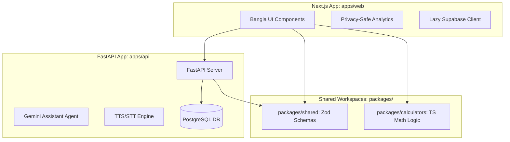
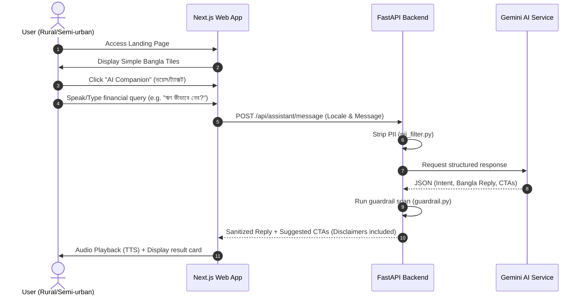

# 01 - Codebase & Product Inventory

## Stack & Architecture Map
The project is built as a monorepo managed with **pnpm workspaces** and **Turborepo** for build/test execution.

### Technical Components
* **Frontend**: Next.js 15 (using App Router) inside [apps/web](file:///C:/Dev_Projects/Financial%20Companion/apps/web/). Styles are managed via plain CSS in [globals.css](file:///C:/Dev_Projects/Financial%20Companion/apps/web/app/globals.css) using design tokens.
* **Backend**: FastAPI inside [apps/api](file:///C:/Dev_Projects/Financial%20Companion/apps/api/), running under Uvicorn. Data access is structured around SQL Alchemy 2.0 async sessions.
* **Database**: PostgreSQL (assumed production backend, running locally with SQLite/Alembic support for testing).
* **AI Orchestration**: Gemini 2.0 Flash (`gemini-2.0-flash`) accessed via `google-genai` inside [agent.py](file:///C:/Dev_Projects/Financial%20Companion/apps/api/app/services/assistant/agent.py).
* **Speech Integration**: Faster-Whisper for STT and a local TTS pipeline integrated in [voice.py](file:///C:/Dev_Projects/Financial%20Companion/apps/api/app/routers/voice.py).

---

## Route & Page Inventory
Below is a map of all user-facing pages located in `apps/web/app/`:

| Path | Purpose | Primary User | Primary Action | Status |
|------|---------|--------------|----------------|--------|
| `/` | Dashboard & portal entry | First-time & returning users | Select a core financial tool | Production-ready |
| `/check-loan` | Guided/wizard loan checker | Borrowers, microfinance clients | Input parameters to find APR | Production-ready |
| `/compare` | Financial product compare | Savers & loan seekers | Filter products by type & apply | Production-ready |
| `/companion` | Voice & text AI assistant | Low-literacy or questioning users | Query financial guide questions | Production-ready |
| `/cashbook` | Personal & business ledger | Small merchants & households | Add income/expense entries | Production-ready (Local) |
| `/health` | Privacy-safe health snapshot | General users | Compute ratio-based health signals | Production-ready |
| `/scenarios` | What-if financial simulator | Savers & business planners | Simulate interest or deposit shifts | Production-ready |
| `/locator` | Branch, MFI, & agent search | Rural users | Search branches by location/GPS | Production-ready |
| `/documents` | Document checklist helper | Loan / FDR applicants | Check and print checklist | Late Prototype |
| `/protect` | Scam / fraud awareness hub | Vulnerable consumers | Read scam signals & tips | Production-ready |
| `/rights` | Consumer rights overview | Borrowers & bank clients | Read land, women & borrower rights | Static Guide |
| `/entitlements` | Govt benefits portal | Rural / underprivileged citizens | Identify eligible allowances | Static Guide |
| `/emergency` | Natural disaster guide | Farmers & flood-affected citizens | Read urgent steps & gov help | Static Guide |
| `/insurance` | Insurance guide | General users | Read insurance options | Static Guide |
| `/remittance` | Remittance receiving guide | Remittance earners' families | Read formal channel procedures | Static Guide |
| `/login` | Partner & whitelabel login | B2B enterprise partners | Input credentials | Mock Page |
| `/profile` | Profile preferences | General users | View session settings | Placeholder |
| `/privacy` | Privacy declaration | Audits & cautious users | View data promises | Static Guide |

---

## Core User Journeys

---

## Component & Design System Inventory
Located primarily in [components/](file:///C:/Dev_Projects/Financial%20Companion/apps/web/app/components/):
1. **`AppHeader`**: Sticky header displaying the product title "আর্থিক সহায়ক" and dynamic back-navigation support.
2. **`BottomNav`**: Mobile-focused navigation bar that hosts the 4 key routes (`/`, `/companion`, `/cashbook`, `/protect`) and triggers the overlay bottom-sheet for secondary modules.
3. **`AudioAssist`**: Contextual TTS component that integrates custom server-side synthesis or browser-native SpeechSynthesis.
4. **`WizardStepHeader`**: Displays steps and validation meters inside the multi-step calculators.

---

## Data & Integration Dependencies
* **Supabase**: Configured lazily in [supabaseClient.ts](file:///C:/Dev_Projects/Financial%20Companion/apps/web/app/lib/supabaseClient.ts) for optional auth and data sync.
* **Gemini API**: Powering the natural language engine in [agent.py](file:///C:/Dev_Projects/Financial%20Companion/apps/api/app/services/assistant/agent.py).
* **Faster-Whisper / local audio pipeline**: Core transcription and voice engines in [voice.py](file:///C:/Dev_Projects/Financial%20Companion/apps/api/app/routers/voice.py).
* **Alembic Database Migrations**: Found under `apps/api/alembic/` to control the schemas of `users`, `leads`, `products`, `locations`, `scenarios`, and `cashbook_entries`.

---

## Areas of Incompleteness or Complexity
1. **Login & Profile**: `/login` and `/profile` are sparse shells that have no actual auth hooks connected to the operational app.
2. **Documents checklists**: `/documents` serves as a static UI list. It does not integrate with local storage or state to let users track which documents they have collected.
3. **Static Guides**: Routes like `/insurance`, `/remittance`, `/entitlements`, and `/rights` are highly repetitive static text wrappers with identical layout hierarchies.
4. **Duplicate Routing**: `/scenarios` and `/events-planner` duplicate interest calculations that should be handled directly inside `/check-loan` or `/savings`.
